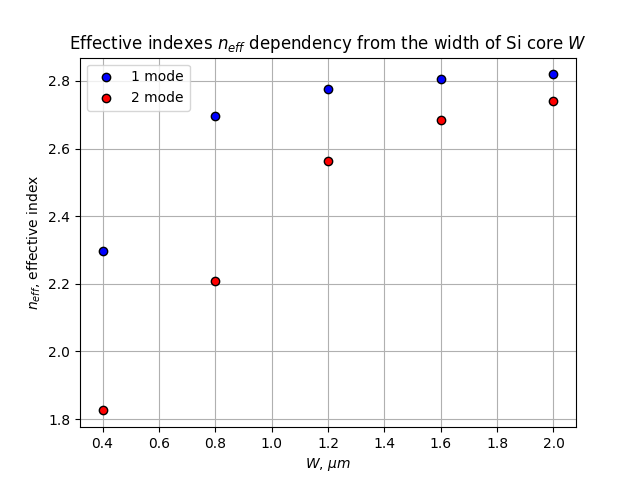
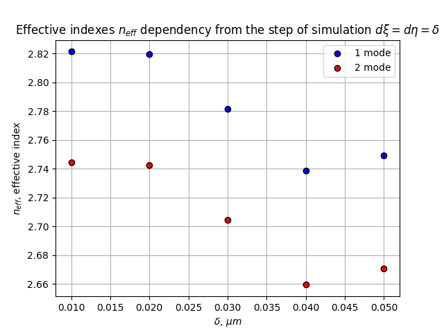
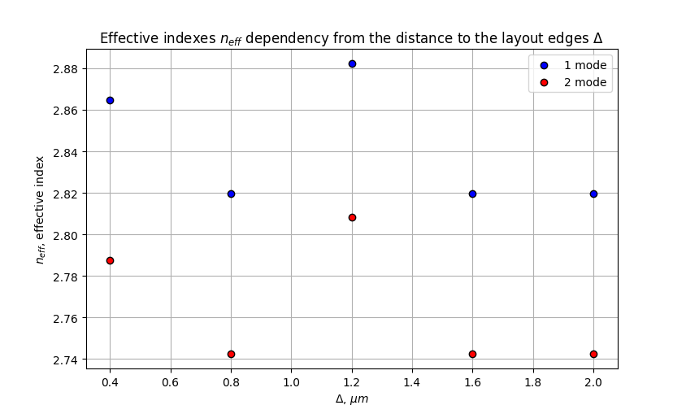

# Curved waveguide modesolver
## Overview
Photonic modesolver for curved planar waveguides.

Method based on finite-difference frequency domains (FDFD) method. About FDFD with index averaging you can read in article by [Zhaoming Zhu and Thomas G. Brown](https://www.researchgate.net/publication/24436723_Full-vectorial_finite-difference_analysis_of_microstructure_optical_fibers/citations).

- fully vectorial option with index averaging technique implementation,
- simple structure drawing,
- perfectly-meatched layer **([PML](https://en.wikipedia.org/wiki/Perfectly_matched_layer))** implementation,
- mode profiles visualization (and other plots) via maplotlib.pyplot,
- overlap calculaion

## Introduction
### Main parameters of the planar waveguide and PML
Main parameters of waveguide cross-section is on the picture below


Also the picture of parameters of the PML parameters, implemented into our scheme of calculations


All these parameters ($x_{left},\ x_{right},\ y_{up},\ y_{down}$) needs to be written into into the number of grids, which you need to pave, f.e. $x_{left} = 100$ means, that the width of the PML at the left will be $100 \times d \xi$ (read about $d \xi$ below).

### Other parameters of simulation
- wavelength $\lambda$ (``lambda``)
- steps for finite-differences in each direction: $d \xi$ (``d_xi``) in horizontal direction, $d \eta$ (``d_eta``) - in vertical direction
- curvature of waveguide $\kappa$ (``kappa``)

## Examples and features implementations
* [Ex1: Mode calculations for straight planar waveguide with default parameters](#example-1-mode-calculations-for-straight-planar-waveguide-with-default-parameters)
* [Ex2: Mode calculations for curved planar waveguide](#example-2-mode-calculations-for-curved-planar-waveguide)
* [Feat1: Effective indexes dependency from a width W of a core](#feature-1-effective-indexes-dependency-from-a-width-W-of-a-core)
* [Feat2: Effective indexes dependency from the step of a simulation](#feature-2-effective-indexes-dependency-from-a-step-of-simulation)
* [Feat3: Effective indexes dependency from the distance to the layout edges](#feature-3-effective-indexes-dependency-from-the-distance-to-the-layout-edges)

## Example 1: Mode calculations for straight planar waveguide with default parameters
Let's see how programm will work with default settings. The default setting is:

* wavelength: 1.55 $\mu m$
* clad refractive index: 1.4444 ($SiO_2$ cladding)
* core refractive index: 3.4755 ($Si$ core)
* grid step size in $\xi$ direction: 0.02 $\mu m$
* grid step size in $\eta$ direction: 0.02 $\mu m$
* width of $Si$ core: 2 $\mu m$
* height of $Si$ core: 0.22 $\mu m$
* distance to the left border of simulation: 2 $\mu m$
* distance to the right border of simulation: 2 $\mu m$
* distance to the upper border of simulation: 2 $\mu m$
* distance to the down border of simulation: 2 $\mu m$
* curvature value: 0 $\mu m^{-1}$

In our script we calculated first 2 modes of waveguide.

### Python script

```python
import curved_modesolver as cms

keke = cms.rect_WG() #constructing the object with default parameters

NPML_l = [100, 100, 100, 100]

keke.FDE(2, NPML_l)

#Visualization
keke.draw_structure()
keke.draw_field(1, 'norm')
keke.draw_field(2, 'norm')
```

#### Structure


#### Modes


## Example 2: Mode calculations for curved planar waveguide
In this script we also will calculate 2 modes. The settings of simulation:

* wavelength: 1.55 $\mu m$
* clad refractive index: 1.4444 ($SiO_2$ cladding)
* core refractive index: 3.4755 ($Si$ core)
* grid step size in $\xi$ direction: 0.02 $\mu m$
* grid step size in $\eta$ direction: 0.02 $\mu m$
* width of $Si$ core: 2 $\mu m$
* height of $Si$ core: 0.22 $\mu m$
* distance to the left border of simulation: 5 $\mu m$
* distance to the right border of simulation: 3 $\mu m$
* distance to the upper border of simulation: 3 $\mu m$
* distance to the down border of simulation: 3 $\mu m$
* curvature value:  $\mu m^{-1}$

### Python script
```python
import curved_modesolver as cms

#Parameters initialization
wavelength = 1.55E-6
n_clad = 1.4444
n_core = 3.4755
d_xi = 2E-8
d_eta = 2E-8
W = 2E-6
H = 2.2E-7
delta_l = 5E-6
delta_r = 5E-6
delta_u = 3E-6
delta_d = 3E-6
kappa = 0.1E6

obj = cms.rect_WG(wavelength, n_clad, n_core, d_xi, d_eta, W, H, delta_l, delta_r, delta_u, delta_d, kappa)

NPML_l = [100, 100, 100, 100]
obj.FDE(2, NPML_l)

#Visualization
obj.draw_structure()
obj.draw_field(1, 'norm')
obj.draw_field(1, 'log')
obj.draw_field(2, 'norm')
obj.draw_field(2, 'log')
```

#### Structure


#### Modes
Normal scale


Log scale


Normal scale


Log scale


Also, you can set negative ``kappa`` value and the mode overleak will be in other side. 
## Feature 1: Effective indexes dependency from a width W of a core


### Python script
```python
import curved_modesolver as cms
import numpy as np
import matplotlib.pyplot as plt

#Initial parameters
wavelength = 1.55E-6
n_clad = 1.4444
n_core = 3.4755
H = 0.22E-6 
widths = np.array([0.4E-6*(i+1) for i in range(5)])
d_eta, d_xi = 0.02E-6, 0.02E-6
delta = 3E-6
indexes = np.array([[]])

#Zero curvature
kappa = 0

NPML_l = [100, 100, 100, 100]

#Calculation
for i in range(len(widths)):
    obj = cms.rect_WG(wavelength, n_clad, n_core, d_xi, d_eta, widths[i], H, delta, delta, delta, delta, kappa)
    obj.FDE(2, NPML_l)
    if i == 0:
        indexes = np.append(indexes, [np.real(obj.n_eff)], axis=1)
    else:
        indexes = np.append(indexes, [np.real(obj.n_eff)], axis=0)

#Visualization
fig, ax=plt.subplots()
ax.set_title(r'Effective indexes $n_{eff}$ dependency from the width of Si core $W$')
ax.set_ylabel(r'$n_{eff}$, effective index')
ax.set_xlabel(r'$W$, $\mu m$')
ax.scatter(widths*10**6, indexes[:, 0], c='blue', edgecolors = 'black', label='1 mode', zorder = 2)
ax.scatter(widths*10**6, indexes[:, 1], c='red',edgecolors = 'black', label='2 mode', zorder = 2)
ax.legend()
ax.grid(True)
plt.show()
```

#### Chart



## Feature 2: Effective indexes dependency from the step of a simulation

### Python script
```python
#Initial parameters
wavelength = 1.55E-6
n_clad = 1.4444
n_core = 3.4755
H = 0.22E-6 
W = 2E-6 
d_eta_xi = np.array(0.01 * (i+1) for i in range(5))
delta = 2E-6
indexes = np.array([[]])

#Zero curvature
kappa = 0.0

NPML_l = [100, 100, 100, 100]

#Calculation
for i in range(len(delta)):
    obj = cms.rect_WG(wavelength, n_clad, n_core, d_eta_xi[i], d_eta_xi[i], W, H, delta, delta, delta, delta, kappa)
    obj.FDE(2, NPML_l)
    if i == 0:
        indexes = np.append(indexes, [np.real(obj.n_eff)], axis=1)
    else:
        indexes = np.append(indexes, [np.real(obj.n_eff)], axis=0)

#Visualization
fig, ax=plt.subplots()
ax.set_title(r'Effective indexes $n_{eff}$ dependency from the step of simulation $d \xi = d \eta = \delta$')
ax.set_ylabel(r'$n_{eff}$, effective index')
ax.set_xlabel(r'$\delta$, $\mu m$')
ax.scatter(d_eta_xi*10**6, indexes[:, 0], c='blue', edgecolors='black', label='1 mode', zorder = 2)
ax.scatter(d_eta_xi*10**6, indexes[:, 1], c='red', edgecolors='black', label = '2 mode', zorder = 2)
ax.legend()
ax.grid(True)
plt.show()
```

#### Chart



## Feature 3: Effective indexes dependency from the distance to the layout edges


### Python script
```python
import curved_modesolver as cms
import numpy as np
import matplotlib.pyplot as plt

#Initial parameters
wavelength = 1.55E-6
n_clad = 1.4444
n_core = 3.4755
H = 0.22E-6 
W = 2E-6 
d_eta, d_xi = 0.02E-6, 0.02E-6
delta = np.array([1E-6*(i+1) for i in range(5)])
indexes = np.array([[]])
kappa = 0.1E6

NPML_l = [100, 100, 100, 100]

#Calculation
for i in range(len(delta)):
    obj = cms.rect_WG(wavelength, n_clad, n_core, d_xi, d_eta, W, H, delta[i], delta[i], delta[i], delta[i], kappa)
    obj.FDE(2, NPML_l)
    if i == 0:
        indexes = np.append(indexes, [np.real(obj.n_eff)], axis=1)
    else:
        indexes = np.append(indexes, [np.real(obj.n_eff)], axis=0)

#Visualization
fig, ax=plt.subplots()
ax.set_title(r'Effective indexes $n_{eff}$ dependency from the distance to the layout edges $\Delta$')
ax.set_ylabel(r'$n_{eff}$, effective index')
ax.set_xlabel(r'$\Delta$, $\mu m$')
ax.scatter(delta*10**6, indexes[:, 0], c='blue', edgecolors='black', label='1 mode', zorder=2)
ax.scatter(delta*10**6, indexes[:, 1], c='red', edgecolors='black', label = '2 mode', zorder=2)
ax.legend()
ax.grid(True)
plt.show()
```

#### Chart



## Future features
- [ ] #1
- [ ] #2
- [ ] #3

First option will be helpful, if user would like to download a picture of the waveguide cross-section, made by pixels of different color. Possibly, program will make available the color encoding process and after that drawing a structure, which was offered by user. It will make possible to calculate various waveguide cross-sections and calculate their modes.

Second and third options will be effective improvements for eigenmodes calculation, because now the proccess of solving equation on eigenmodes takes huge amount of time. Parallel computing will decrease the time of calculation and machine learning will make possible some other features: finding the optimal cross-section of waveguide, speed of calculations improvement and etc.

And maybe something more, we will see :smirk: 

## Acknowledgments

There are also many great eigesolvers, which are available for free on Github:

* [EMpy](https://github.com/lbolla/EMpy)
* [modesolverpy](https://github.com/jtambasco/modesolverpy)
* [Awesome Photonics](https://github.com/joamatab/awesome_photonics) - bunch of different materials for photonics design: simulations, lab automation, layouts and etc.

Thanks my lab for support, my family for being with me in tough times! I extremely love you :heart: 

na predele effectivnosty! 